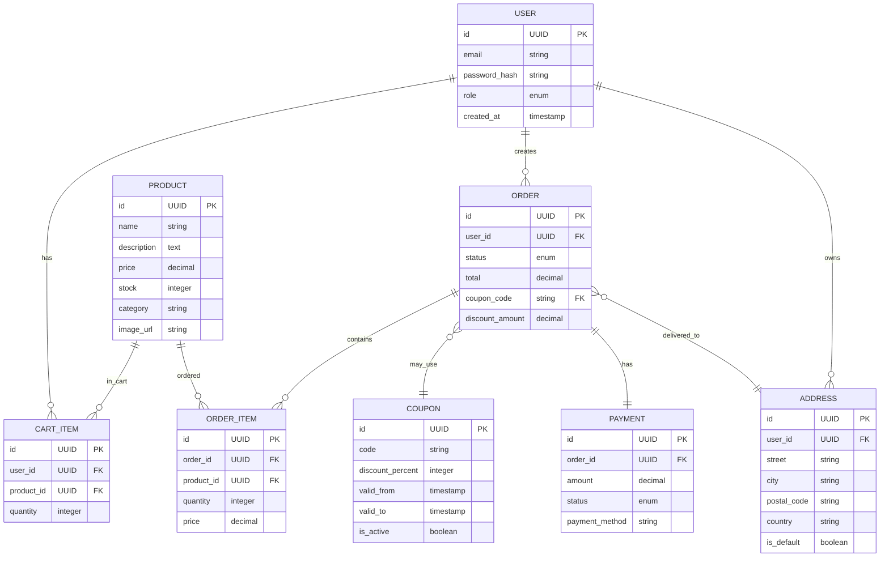

# Вариант 13 — Микро-шоп «Добавь в корзину» — Ключевые сущности, связи и API

Сущности (основные)

- User
  - id: UUID (PK)
  - email: string (unique, not null)
  - password_hash: string (not null)
  - role: enum [USER, ADMIN] (default: USER)
  - created_at: timestamp
  - updated_at: timestamp

- Product
  - id: UUID (PK)
  - name: string (not null)
  - description: text
  - price: decimal (not null, > 0)
  - stock: integer (not null, >= 0)
  - category: string
  - image_url: string
  - created_at: timestamp
  - updated_at: timestamp

- CartItem
  - id: UUID (PK)
  - user_id: UUID (FK -> User.id, not null)
  - product_id: UUID (FK -> Product.id, not null)
  - quantity: integer (not null, > 0)
  - created_at: timestamp
  - updated_at: timestamp
  - unique(user_id, product_id)

- Order
  - id: UUID (PK)
  - user_id: UUID (FK -> User.id, not null)
  - status: enum [PENDING, PAID, PROCESSING, SHIPPED, DELIVERED, CANCELLED] (default: PENDING)
  - total: decimal (not null, >= 0)
  - coupon_code: string (FK -> Coupon.code, nullable)
  - discount_amount: decimal (default: 0)
  - created_at: timestamp
  - updated_at: timestamp

- OrderItem
  - id: UUID (PK)
  - order_id: UUID (FK -> Order.id, not null)
  - product_id: UUID (FK -> Product.id, not null)
  - quantity: integer (not null, > 0)
  - price: decimal (not null, > 0) — цена на момент заказа

- Address
  - id: UUID (PK)
  - user_id: UUID (FK -> User.id, not null)
  - street: string (not null)
  - city: string (not null)
  - postal_code: string (not null)
  - country: string (not null)
  - is_default: boolean (default: false)
  - created_at: timestamp

- Coupon
  - id: UUID (PK)
  - code: string (unique, not null)
  - discount_percent: integer (not null, 0-100)
  - valid_from: timestamp (not null)
  - valid_to: timestamp (not null)
  - is_active: boolean (default: true)
  - created_at: timestamp

- Payment
  - id: UUID (PK)
  - order_id: UUID (FK -> Order.id, not null)
  - amount: decimal (not null, > 0)
  - status: enum [PENDING, COMPLETED, FAILED, REFUNDED] (default: PENDING)
  - payment_method: string (default: "mock")
  - created_at: timestamp
  - updated_at: timestamp

Связи (ER-эскиз)

- User 1..* CartItem (пользователь имеет элементы корзины)
- User 1..* Order (пользователь создаёт заказы)
- User 1..* Address (пользователь имеет адреса доставки)
- Product 1..* CartItem (товар может быть в корзинах)
- Product 1..* OrderItem (товар входит в заказы)
- Order 1..* OrderItem (заказ содержит позиции)
- Order 0..1 Coupon (заказ может использовать купон)
- Order 1..1 Payment (заказ имеет платёж)
- Order 0..1 Address (заказ может иметь адрес доставки)

Обязательные поля и ограничения (кратко)

- unique(User.email)
- unique(Coupon.code)
- unique(CartItem.user_id, CartItem.product_id)
- Product.price > 0
- Product.stock >= 0
- CartItem.quantity > 0
- OrderItem.quantity > 0
- OrderItem.price > 0
- Coupon.discount_percent >= 0 AND <= 100
- Coupon.valid_from < Coupon.valid_to

API — верхнеуровневые ресурсы и операции

- /api/auth
  - POST /api/auth/register — регистрация пользователя
  - POST /api/auth/login — вход в систему
  - POST /api/auth/refresh — обновление токена

- /api/products
  - GET /api/products — список товаров (с фильтрами, пагинацией)
  - GET /api/products/{id} — детали товара
  - POST /api/products — создание товара (admin)
  - PUT /api/products/{id} — обновление товара (admin)
  - DELETE /api/products/{id} — удаление товара (admin)

- /api/cart
  - GET /api/cart — получить корзину текущего пользователя
  - POST /api/cart/items — добавить товар в корзину
  - PUT /api/cart/items/{id} — изменить количество
  - DELETE /api/cart/items/{id} — удалить из корзины
  - DELETE /api/cart — очистить корзину

- /api/orders
  - GET /api/orders — список заказов пользователя (admin: все заказы)
  - GET /api/orders/{id} — детали заказа
  - POST /api/orders — создать заказ из корзины
  - PUT /api/orders/{id}/status — изменить статус (admin)

- /api/coupons
  - GET /api/coupons/{code} — проверить купон
  - POST /api/coupons — создать купон (admin)
  - GET /api/coupons — список купонов (admin)
  - PUT /api/coupons/{id} — обновить купон (admin)
  - DELETE /api/coupons/{id} — деактивировать купон (admin)

- /api/payments
  - POST /api/payments — создать платёж (заглушка)
  - GET /api/payments/{id} — статус платежа

- /api/addresses
  - GET /api/addresses — список адресов пользователя
  - POST /api/addresses — добавить адрес
  - PUT /api/addresses/{id} — обновить адрес
  - DELETE /api/addresses/{id} — удалить адрес

- /api/admin
  - GET /api/admin/users — список пользователей
  - PUT /api/admin/users/{id}/block — заблокировать пользователя
  - GET /api/admin/statistics — статистика продаж

Дополнительно (бонусы)

- Документация API (OpenAPI/Swagger) — доступна на /swagger-ui.html
- Тесты: unit + интеграционные для сервисов и контроллеров
- Redis кэширование для каталога товаров и корзины

---

## Подробные операции API, схемы и поведение

Общие принципы

- Ответы в формате JSON
- Пагинация: `page` (default: 0) и `size` (default: 20) для списков
- Аутентификация: `Authorization: Bearer <jwt>`; роли: `USER`, `ADMIN`
- Ошибки возвращаются в формате: `{ "status": "error", "message": "...", "errors": {...} }`

Примеры ошибок (JSON)

```json
{
  "status": "error",
  "message": "Validation failed",
  "errors": {
    "email": "Email is required",
    "price": "Price must be greater than 0"
  }
}
```

Auth

- POST `/api/auth/register` — `{email, password, name?}` → `201 {id, email, role, accessToken, refreshToken}`
- POST `/api/auth/login` — `{email, password}` → `200 {accessToken, refreshToken, user: {id, email, role}}`
- POST `/api/auth/refresh` — `{refreshToken}` → `200 {accessToken}`

Products

- GET `/api/products?category=&minPrice=&maxPrice=&search=&page=&size=` — список товаров
  - Response: `200 {content: [...], totalElements, totalPages, page, size}`
- GET `/api/products/{id}` — детали товара → `200 {id, name, description, price, stock, category, imageUrl}`
- POST `/api/products` — Admin `{name, description, price, stock, category, imageUrl?}` → `201 {id, ...}`
- PUT `/api/products/{id}` — Admin `{name?, description?, price?, stock?, category?, imageUrl?}` → `200 {id, ...}`
- DELETE `/api/products/{id}` — Admin → `204 No Content`

Cart

- GET `/api/cart` — получить корзину → `200 {items: [{id, product, quantity, subtotal}], total}`
- POST `/api/cart/items` — `{productId, quantity}` → `201 {id, product, quantity}`
- PUT `/api/cart/items/{id}` — `{quantity}` → `200 {id, product, quantity}`
- DELETE `/api/cart/items/{id}` — удалить элемент → `204`
- DELETE `/api/cart` — очистить корзину → `204`

Orders

- GET `/api/orders?status=&page=&size=` — список заказов (user: только свои, admin: все)
- GET `/api/orders/{id}` — детали заказа → `200 {id, status, total, items: [...], address, coupon, payment, createdAt}`
- POST `/api/orders` — `{addressId, couponCode?}` → `201 {id, status, total, ...}`
- PUT `/api/orders/{id}/status` — Admin `{status}` → `200 {id, status, ...}`

Coupons

- GET `/api/coupons/{code}` — проверить купон → `200 {code, discountPercent, valid, message?}`
- POST `/api/coupons` — Admin `{code, discountPercent, validFrom, validTo}` → `201 {id, code, ...}`
- GET `/api/coupons?isActive=&page=&size=` — список купонов (admin)
- PUT `/api/coupons/{id}` — Admin `{discountPercent?, validFrom?, validTo?, isActive?}` → `200 {id, ...}`
- DELETE `/api/coupons/{id}` — Admin → `204`

Payments

- POST `/api/payments` — `{orderId, paymentMethod?}` → `201 {id, status, amount}` (заглушка: статус COMPLETED)
- GET `/api/payments/{id}` — статус платежа → `200 {id, status, amount, createdAt}`

Addresses

- GET `/api/addresses` — список адресов → `200 [{id, street, city, postalCode, country, isDefault}]`
- POST `/api/addresses` — `{street, city, postalCode, country, isDefault?}` → `201 {id, ...}`
- PUT `/api/addresses/{id}` — `{street?, city?, postalCode?, country?, isDefault?}` → `200 {id, ...}`
- DELETE `/api/addresses/{id}` — `204`

---

## ERD (диаграмма сущностей)

Mermaid-диаграмма:



ASCII-эскиз:

```text
User 1---* CartItem *---1 Product
User 1---* Order 1---* OrderItem *---1 Product
Order 0---1 Coupon
Order 1---1 Payment
Order 0---1 Address
User 1---* Address
```

---

## AC — критерии приёмки для функционала (MVP)

- AC1: Пользователь может зарегистрироваться, войти и получить JWT токен.
- AC2: Пользователь может просматривать каталог товаров с фильтрами по категории, цене и поиском.
- AC3: Пользователь может добавлять товары в корзину, изменять количество и удалять.
- AC4: Пользователь может применить купон при оформлении заказа, скидка корректно рассчитывается.
- AC5: Пользователь может оформить заказ с указанием адреса доставки, заказ создаётся со статусом PENDING.
- AC6: Администратор может создавать, редактировать и удалять товары.
- AC7: Администратор может просматривать все заказы и изменять их статус.
- AC8: Администратор может создавать и управлять купонами.
