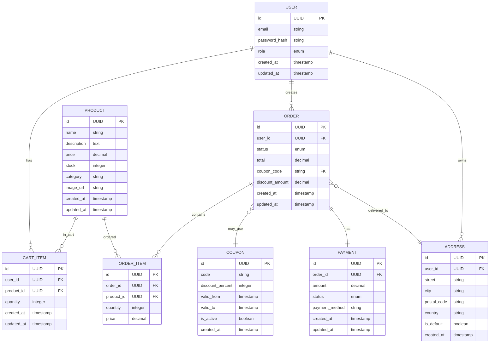

# Вариант 13 — Микро-шоп «Добавь в корзину» — ERD (диаграмма сущностей)

Файл содержит: 1) mermaid-диаграмму ERD; 2) ASCII-эскиз; 3) минимальный SQL DDL-скетч для создания таблиц.

## Mermaid ERD



## ASCII-эскиз

```text
User 1---* CartItem *---1 Product
User 1---* Order 1---* OrderItem *---1 Product
Order 0---1 Coupon
Order 1---1 Payment
Order 0---1 Address
User 1---* Address
```

## Минимальный SQL DDL (пример, PostgreSQL)

```sql
CREATE TABLE users (
    id UUID PRIMARY KEY DEFAULT gen_random_uuid(),
    email VARCHAR(255) UNIQUE NOT NULL,
    password_hash VARCHAR(255) NOT NULL,
    role VARCHAR(20) NOT NULL DEFAULT 'USER' CHECK (role IN ('USER', 'ADMIN')),
    created_at TIMESTAMP WITH TIME ZONE DEFAULT CURRENT_TIMESTAMP,
    updated_at TIMESTAMP WITH TIME ZONE DEFAULT CURRENT_TIMESTAMP
);

CREATE TABLE products (
    id UUID PRIMARY KEY DEFAULT gen_random_uuid(),
    name VARCHAR(255) NOT NULL,
    description TEXT,
    price DECIMAL(10, 2) NOT NULL CHECK (price > 0),
    stock INTEGER NOT NULL DEFAULT 0 CHECK (stock >= 0),
    category VARCHAR(100),
    image_url VARCHAR(500),
    created_at TIMESTAMP WITH TIME ZONE DEFAULT CURRENT_TIMESTAMP,
    updated_at TIMESTAMP WITH TIME ZONE DEFAULT CURRENT_TIMESTAMP
);

CREATE TABLE cart_items (
    id UUID PRIMARY KEY DEFAULT gen_random_uuid(),
    user_id UUID NOT NULL REFERENCES users(id) ON DELETE CASCADE,
    product_id UUID NOT NULL REFERENCES products(id) ON DELETE CASCADE,
    quantity INTEGER NOT NULL CHECK (quantity > 0),
    created_at TIMESTAMP WITH TIME ZONE DEFAULT CURRENT_TIMESTAMP,
    updated_at TIMESTAMP WITH TIME ZONE DEFAULT CURRENT_TIMESTAMP,
    UNIQUE(user_id, product_id)
);

CREATE TABLE addresses (
    id UUID PRIMARY KEY DEFAULT gen_random_uuid(),
    user_id UUID NOT NULL REFERENCES users(id) ON DELETE CASCADE,
    street VARCHAR(255) NOT NULL,
    city VARCHAR(100) NOT NULL,
    postal_code VARCHAR(20) NOT NULL,
    country VARCHAR(100) NOT NULL,
    is_default BOOLEAN DEFAULT FALSE,
    created_at TIMESTAMP WITH TIME ZONE DEFAULT CURRENT_TIMESTAMP
);

CREATE TABLE coupons (
    id UUID PRIMARY KEY DEFAULT gen_random_uuid(),
    code VARCHAR(50) UNIQUE NOT NULL,
    discount_percent INTEGER NOT NULL CHECK (discount_percent >= 0 AND discount_percent <= 100),
    valid_from TIMESTAMP WITH TIME ZONE NOT NULL,
    valid_to TIMESTAMP WITH TIME ZONE NOT NULL,
    is_active BOOLEAN DEFAULT TRUE,
    created_at TIMESTAMP WITH TIME ZONE DEFAULT CURRENT_TIMESTAMP,
    CHECK (valid_from < valid_to)
);

CREATE TABLE orders (
    id UUID PRIMARY KEY DEFAULT gen_random_uuid(),
    user_id UUID NOT NULL REFERENCES users(id) ON DELETE CASCADE,
    status VARCHAR(20) NOT NULL DEFAULT 'PENDING' CHECK (status IN ('PENDING', 'PAID', 'PROCESSING', 'SHIPPED', 'DELIVERED', 'CANCELLED')),
    total DECIMAL(10, 2) NOT NULL CHECK (total >= 0),
    coupon_code VARCHAR(50) REFERENCES coupons(code),
    discount_amount DECIMAL(10, 2) DEFAULT 0,
    address_id UUID REFERENCES addresses(id),
    created_at TIMESTAMP WITH TIME ZONE DEFAULT CURRENT_TIMESTAMP,
    updated_at TIMESTAMP WITH TIME ZONE DEFAULT CURRENT_TIMESTAMP
);

CREATE TABLE order_items (
    id UUID PRIMARY KEY DEFAULT gen_random_uuid(),
    order_id UUID NOT NULL REFERENCES orders(id) ON DELETE CASCADE,
    product_id UUID NOT NULL REFERENCES products(id) ON DELETE CASCADE,
    quantity INTEGER NOT NULL CHECK (quantity > 0),
    price DECIMAL(10, 2) NOT NULL CHECK (price > 0)
);

CREATE TABLE payments (
    id UUID PRIMARY KEY DEFAULT gen_random_uuid(),
    order_id UUID NOT NULL REFERENCES orders(id) ON DELETE CASCADE,
    amount DECIMAL(10, 2) NOT NULL CHECK (amount > 0),
    status VARCHAR(20) NOT NULL DEFAULT 'PENDING' CHECK (status IN ('PENDING', 'COMPLETED', 'FAILED', 'REFUNDED')),
    payment_method VARCHAR(50) DEFAULT 'mock',
    created_at TIMESTAMP WITH TIME ZONE DEFAULT CURRENT_TIMESTAMP,
    updated_at TIMESTAMP WITH TIME ZONE DEFAULT CURRENT_TIMESTAMP
);

-- Индексы для производительности
CREATE INDEX idx_cart_items_user_id ON cart_items(user_id);
CREATE INDEX idx_cart_items_product_id ON cart_items(product_id);
CREATE INDEX idx_orders_user_id ON orders(user_id);
CREATE INDEX idx_orders_status ON orders(status);
CREATE INDEX idx_order_items_order_id ON order_items(order_id);
CREATE INDEX idx_order_items_product_id ON order_items(product_id);
CREATE INDEX idx_products_category ON products(category);
CREATE INDEX idx_products_price ON products(price);
CREATE INDEX idx_coupons_code ON coupons(code);
CREATE INDEX idx_coupons_valid ON coupons(valid_from, valid_to, is_active);
```
